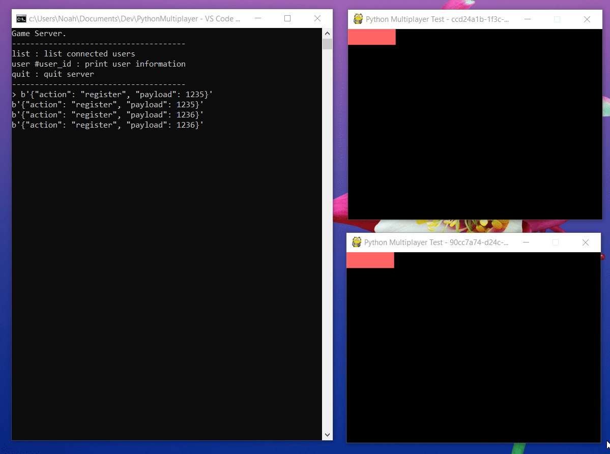

# PythonMultiplayer

Simple multiplayer UDP server with Python

Boilerplate for basic UDP networking for simple python games

## Pre-req

Must have `Python 3+`
I'm currently not using any Python 3 features like async so it should be rather simple to backport to Python 2 if you want to

**Recommended**:
Install [pipenv](https://github.com/pypa/pipenv).
Project comes with a Pipfile. Simply run `pipenv install` to install dependencies and set up a virtualenv.

If you wish to use something like `virtualenv` and `pip` on it's own, feel free. Only dependency is `pygame` for display purposes.

## How to run

`git clone https://github.com/NoahBres/PythonMultiplayer`

**If you're using VSCode**:
Project comes with a .vscode `launch.json` so check those out. Simply select a debug profile.
`Server` launches the server. `Client 1` lauches the client with a UDP port of 1235. `Client 2` launches the client with a UDP port of 1236. `Server/Client` launches `Server` and `Client 1`. `Server/Client/Client` launches `Server`, `Client 1`, and `Client 2`. `Client1/Client2` launches both clients`

**Otherwise**:

_To launch server_:

1.  Navigate to `PythonMultiplayer/PythonMultiplayer/server`
2.  run `python -m server --tcpport 1234 --udpport 1234`

_To launch client_:

1.  Navigate to `PythonMultiplayer/PythonMultiplayer/client`
2.  run `python -m client --tcpport 1234 --udpport 1234 --socket 1235`

## Demo

## Source explanation

`client` - contains all the client code
`server` - contains all the server code

`server/server.py` - Starts TCP and UDP server threads
`server/tcp_server.py` - TCP Server handles important events that shouldn't be dropped. Does client registration and sends a client list to the rest of the clients.
`server/udp_server.py` - UDP Server handles sockets to clients. Currently just gets move commands from the client to update the client positions.
`server/client.py` - Client object. Contains the udp address and id of the client. Contains `send_tcp` and `send_udp` functions to send messages to each client.

`client/client.py` - Handles communication with the server. Had a socket thread to udp messages. Handles registrations and message sending.
`client/network_entity.py` - Tracks other clients connected to the server
`client/game.py` - Game part to display the clients
`client/player.py` - Simple game object to handle drawing/updating
